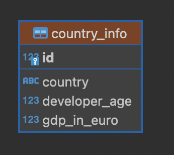
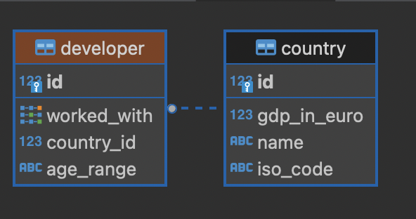

# abn-amro-assignment

## Preface - saving GDP data

In essence, when saving the Gross Domestic Product (GDP) data, we only need 2 columns; the country name and the GDP in euro's itself. There are rows which have multiple countries collected in one row. Those needs to be filtered out.

This starts with saving the from the public API endpoint [endpoint](https://ec.europa.eu/eurostat/api/dissemination/statistics/1.0/data/TEC00001?format=JSON&lang=en&unit=CP_EUR_HAB&time=2021) of the GDP data provider, which we can then insert in our database. Since 2022 hasn't ended yet, I'm using data from last year; 2021. The filters are applied on the data provider's website.

Actually, SQL isn't even mandatory unless we want to persist data at a certain timestamp. If you always want to keep up to date, assuming this data get's updated, we can call the endpoint itself and fetch save it into memory.

To keep it simple (KISS principle), we just have a seed script which populates the database. We'll use a Python package called click.

## Preface - saving StackOverflow data

The insights on StackOverflow don't have a public API, unless you want to download files and parse them and so on. We could, but let's just put a CURL command in this readme to fetch it to the repository. I wouldn't advice to add it to the repository, big file with probably sensitive data.

Because we're using data from GDP data from 2021, we're using 2021 data from StackOverflow. Not all data is required though, we can filter out the columns and rows that we don't need.

## Setting up our environment

For the sake of this project, we're using a simple virtual environment to install our dependencies in. Using Python 3.11, use the following command to create and activate the environment;

```sh
python3.11 -m venv .venv
source .venv/bin/activate
```

To set up the enviroment, use the `make` command in the root of the project. We're using a `src` directory structure to easily self-install (and use) the project as a package. To stop working on the project, use `deactivate`.

For the database, a running PostgreSQL server is required. The credentials can be configured under the `DATABASE_NAME`, `DATABASE_USER` and `DATABASE_PASSWORD` environment varialble (.env file). See the example .env file [here](./.env.example). For testing, a database called `abnamro_test` is required.

## Part 1

An SQL relationship between the GDP data and the age that developers of a country first start coding isn't needed. In the most simple case, if we want to have it in a database, we can have 4 columns:



This is a pretty clean solution for just that, but doesn't take care of the top 3 programming languages.

To store the data needed for part 3, we need the 3 most popular languages of the year we're looking for. We could calculate the those ourself, but lets check [this link](https://insights.stackoverflow.com/survey/2021#section-most-popular-technologies-programming-scripting-and-markup-languages). It's JavaScript, HTML/CSS and Python. To retrieve this data, we can look at the `LanguageHaveWorkedWith` column in the StackOverflow data.

This approach can be done with 2 tables, using a many-to-one relationship with a `developer` table and the use of [PostgreSQL Array types](https://www.postgresql.org/docs/current/arrays.html). We don't need all the data from the input.



## Part 2

For creating the web service, I'm preferring Flask. This servers a minimalistic approach; it doesn't have to be asyncronous and doesn't need much other features offered by Django or a similar framework.

### Scalabity improvements

1. When wanting better performance, go for a framework with asyncronous and concurrency support. A great one is [FastAPI](https://fastapi.tiangolo.com).
2. When dealing with lots of updates and new deployments, it might be a great idea to use Docker and a container registry to pull from. This allows the application to always have one environment to live in.

Run the API with `flask --app abn_assignment.api run`.

## Part 3

Make sure the data is loaded and the SQL server is running. Then, execute the query located at [src/abn_assignment/pivot.sql](src/abn_assignment/pivot.sql). This can be done by the following command (taken from [this StackOverflow answer](https://stackoverflow.com/a/12085561/2989034)).

```sh
psql -U <username> -d <database_name> -a -f src/abn_assignment/pivot.sql
```

<!-- TODO add conclusion why i didn't add a main branch yet -->
